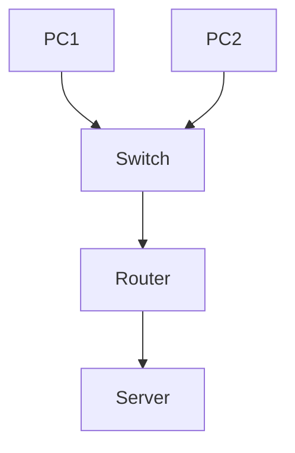

# Infrastructure Réseau Cisco (Packet Tracer)


Conception et simulation d’une infrastructure réseau d’entreprise sous **Cisco Packet Tracer**, incluant configuration des équipements, segmentation réseau et validation de la connectivité.

---

## Résumé exécutif

Réalisation d’une topologie réseau simulée intégrant **routeurs, switchs et hôtes**, avec configuration des protocoles de base (adressage IP, routage, VLAN) et **tests de connectivité**.

Objectif : démontrer des compétences en **réseaux (niveau CCNA)**, **configuration Cisco** et **diagnostic réseau**.

---

## Périmètre technique

* Outil : Cisco Packet Tracer
* Équipements : Routeurs, Switchs, PCs
* Protocoles : IPv4, VLAN, routage (statique / dynamique selon le projet)
* Services : DHCP / DNS (selon scénario du PDF)

---

## Réalisations clés

* Conception d’une **topologie réseau complète**
* Configuration des **interfaces réseau (IP, masque, gateway)**
* Mise en place de **VLANs** (segmentation réseau)
* Configuration du **routage inter-VLAN**
* Implémentation de services réseau (DHCP, DNS si présent)
* Validation de la connectivité (ping, tests de bout en bout)

---

## Architecture réseau



---

## Exemples de configuration

### Configuration interface (routeur)

```cisco
interface GigabitEthernet0/0
 ip address 192.168.1.1 255.255.255.0
 no shutdown
```

### VLAN (switch)

```cisco
vlan 10
 name USERS
```

### Affectation port VLAN

```cisco
interface FastEthernet0/1
 switchport mode access
 switchport access vlan 10
```

---

## Tests et validation

* Test de connectivité :

```bash
ping 192.168.1.1
```

* Vérification des interfaces :

```cisco
show ip interface brief
```

* Vérification VLAN :

```cisco
show vlan brief
```

---

## Compétences démontrées

* Réseaux (niveau CCNA)
* Configuration équipements Cisco
* Segmentation réseau (VLAN)
* Routage inter-VLAN
* Diagnostic réseau
* Lecture et compréhension d’une topologie

---

## Limites

* Environnement simulé (Packet Tracer)
* Pas de matériel réel
* Sécurité avancée non implémentée (ACL, firewall avancé)

---

## Perspectives d’amélioration

* Implémentation d’ACL (filtrage réseau)
* Mise en place de routage dynamique (OSPF, RIP)
* Ajout de redondance (HSRP)
* Sécurisation des ports (Port Security)
* Supervision réseau

---

## Valeur professionnelle

Ce projet démontre la capacité à :

* Concevoir une architecture réseau fonctionnelle
* Configurer des équipements Cisco
* Comprendre les mécanismes de routage et segmentation
* Diagnostiquer des problèmes réseau

---

## Structure

```text
.
├── Cisco packet tracer (1).pdf
└── README.md
```

---

## Documentation

Le fichier PDF contient :

* la topologie réseau
* les configurations détaillées
* les tests réalisés

---

## Auteur

Alexis Noiret
Étudiant en cybersécurité
